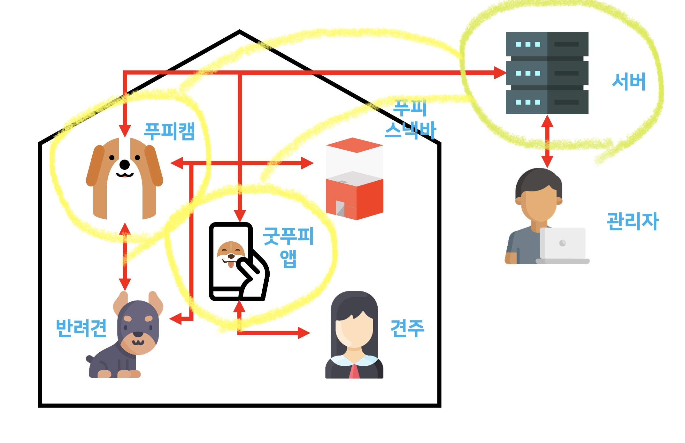

# Backend & Machine Learning Repo

SW Maestro 11기 팀 우릴봐

- 하경민 (팀장)
- 방승연
- 전형준

담당 멘토

- 강진범
- 김윤래
- 박정규
- 오은석
- 최광선

<!-- TABLE OF CONTENTS -->
## Table of Contents

- [Backend & Machine Learning Repo](#backend--machine-learning-repo)
  - [Table of Contents](#table-of-contents)
  - [About The Project](#about-the-project)
    - [Backend](#backend)
    - [Deep learning](#deep-learning)
    - [Built With](#built-with)
  - [Getting Started](#getting-started)
    - [Prerequisites](#prerequisites)
    - [Installation](#installation)
  - [Contact](#contact)
    - [팀 우릴봐](#팀-우릴봐)


<!-- ABOUT THE PROJECT -->
## About The Project



### Backend

푸피캠과 굿푸피 앱을 위한 REST API 서버를 개발합니다.

### Deep learning

푸피캠 라즈베리파이에 탑재할 반려견 배변 행동 및 상황 분류 모델을 개발합니다.

- pose_decision
    1. object_detection.ipynb

        동영상 혹은 이미지를 입력으로 받아 객체 탐지를 수행하고, 강아지가 탐지되면 해당 부분을 잘라내 이미지로 저장

    2. construct_data_set.ipynb

        동영상 혹은 이미지를 입력으로 받아 객체 탐지를 수행하고, 강아지가 탐지되면 해당 부분을 미리 학습 시켜둔 자세 판단 모델에 넣어 그 결과에 따라 알맞은 폴더에 이미지를 저장해 데이터셋을 구축

    3. training.ipynb

        mobileNet 기반의 모델을 구축하고, 강아지 자세에 따라 "poo", "pee", "nothing"으로 판별하도록 학습시키고, 학습이 완료되면 모델을 저장

    4. predict.ipynb

        학습된 모델을 불러와 강아지 자세 예측을 수행

- model
    1. mobileNet.tflite

        강아지 사진을 입력으로 받아 "poo", "pee", "nothing" 중 하나의 결과로 판단하는 mobileNet 기반 자세 판단 모델의 tensorflow lite 버전. **edge TPU가 없는 환경에서 사용**하는 모델

    2. mobileNet_edgetpu.tflite

        강아지 사진을 입력으로 받아 "poo", "pee", "nothing" 중 하나의 결과로 판단하는 mobileNet 기반 자세 판단 모델의 edge TPU 전용 버전. Google coral과 같은 **edge TPU 환경에서 사용**하는 모델

- deeplabcut
    1. saved_model_from_deeplabcut.ipynb

        동물의 스켈레톤을 예측하는 DeepLabCut 모듈에서 강아지의 스켈레톤을 예측하는 모델만 .pb 파일로 저장

    2. predict_by_saved_model.ipynb

        saved_model_from_deeplabcut.ipynb으로 저장한 모델 파일을 이용하여 강아지 사진의 스켈레톤을 예측

    3. predict_video.ipynb

        saved_model_from_deeplabcut.ipynb으로 저장한 모델 파일을 이용하여 강아지 영상의 스켈레톤을 예측

### Built With

- Flask
- MYSQL
- Docker-compose
- AWS S3
- Jupyter notebook

<!-- GETTING STARTED -->
## Getting Started

### Prerequisites

- docker

[docker installation page](https://www.docker.com/get-started)

### Installation

<!-- 1. Get a free API Key at [https://example.com](https://example.com) -->
1. Clone the repo
```sh
git clone https://git.swmgit.org/swmaestro/urillbwa-1.git
```
2. Just 'docker-compose up'
```sh
docker-compose up -d
```

<!-- USAGE EXAMPLES -->
<!-- ## Usage

Use this space to show useful examples of how a project can be used. Additional screenshots, code examples and demos work well in this space. You may also link to more resources.

_For more examples, please refer to the [Documentation](https://example.com)_ -->

<!-- CONTACT -->
## Contact

### 팀 우릴봐

- 하경민 (팀장) gaonrudal@gmail.com
- 방승연 baaaang_53@yonsei.ac.kr
- 전형준 chariot0720@gmail.com
